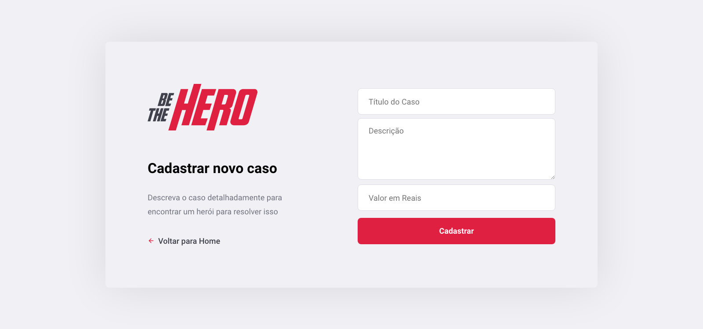

# OmniStack11-Be-The-Hero
Project "Be The Hero" by RocketSeat in the Eleventh edition of "Semana OmniStack"

This app was made for ONGs share your cases with values and a "Hero" find this cases and pay for the cause

It was made using Node.js, ReactJS and React Native <b>in five days</b>

<ul>
  <li>First day was only an introduction and "Hello World"  
  
  <li>Second was created all the backend and APIs  
  
  
  
  <li>Third was the web project, using ReactJS  

  Logon page:
  
  
  Register page:
  
  
  Incidents page:
  
  
  New Incident page:
  

  <li>Fourth was created all the mobile project using React Native and Expo 
  
  Icon and Spash screen:  
  
  
  List of Incidents(Mobile) screen:  
  
  
  Incident(Mobile) screen:  
  
  
  <li>And at last day we made some unit tests and integration tests:
  
  
  
</ul>

Thanks RocketSeat!
